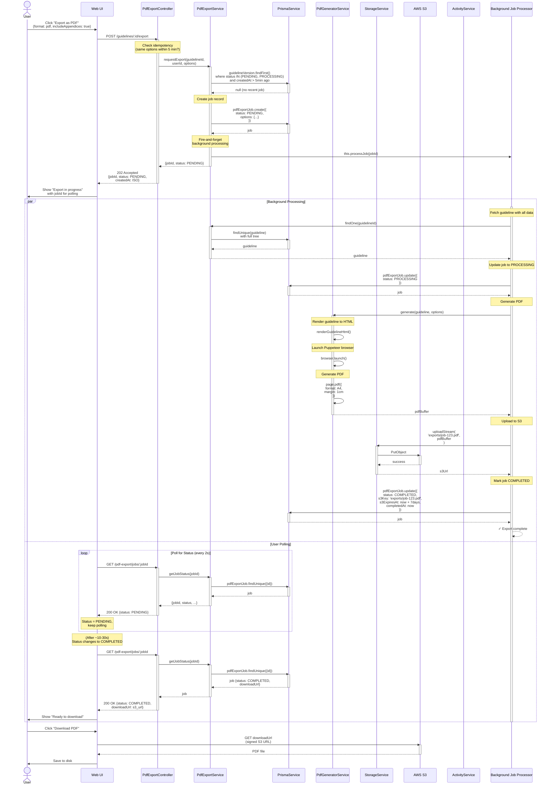

# PDF Export Workflow

## Overview

This sequence diagram shows the async flow when a user exports a guideline as PDF. The system immediately queues the export job and returns a jobId, then generates the PDF in the background and uploads it to S3 for download.

## Process Steps

1. User requests PDF export with options
2. PdfExportController creates job record
3. Return jobId immediately to user
4. Background process picks up job
5. PdfGeneratorService renders HTML and creates PDF
6. StorageService uploads PDF to S3
7. Job status updated to COMPLETED
8. User polls for completion
9. User downloads PDF from S3

## Sequence Diagram



## Key Decisions

### 1. Async Pattern

PDF generation is asynchronous because:
- PDF generation takes 10-30 seconds
- Synchronous wait would timeout HTTP connections
- Multiple PDF exports shouldn't block each other
- Resource efficiency: no threads blocked waiting

### 2. Immediate Response

The API returns a jobId within ~5ms so:
- User gets instant feedback
- Can close the dialog and continue working
- Polling is optional but available

### 3. Background Processing

A separate process handles PDF generation:
- Can be run in separate worker processes or threads
- Can be scaled independently
- Can be queued and retried on failure
- Doesn't block the API server

### 4. S3 Storage

PDFs are uploaded to S3 because:
- Persistent, durable storage
- Accessed independently from API
- Can be downloaded later if needed
- Complies with data archival requirements
- Enables CDN distribution

### 5. Signed URLs

S3 URLs are signed with short expiration times:
- URLs are valid for 7 days
- No public read access to all PDFs
- Can revoke access by deleting job record
- Users can't share long-lived download links

## Polling Strategy

The client uses exponential backoff polling:

```typescript
// Initial poll immediately
const delay = 500;  // 500ms

while (job.status === 'PENDING' || job.status === 'PROCESSING') {
  await sleep(delay);
  const updated = await fetch(`/pdf-export/jobs/${jobId}`);

  // Exponential backoff up to 5s
  delay = Math.min(delay * 1.5, 5000);
}
```

This balances:
- User responsiveness (fast initial polls)
- Server load (slower polls as time increases)
- Total polling time (usually 10-30s)

## Error Handling

### PDF Generation Fails

```
Background worker catches exception:
  → job.status = FAILED
  → job.errorMessage = error.message
  → User polls and sees status = FAILED
  → User clicks "Retry" or contacts support
```

### S3 Upload Fails

```
Background worker catches exception:
  → job.status = FAILED
  → Manual retry can be triggered
  → Or automatic retry after 1 hour
```

### Guideline Not Found

```
If guideline is deleted before generation starts:
  → job.status = FAILED
  → errorMessage = "Guideline not found"
```

### Permission Denied

```
If user loses access during export:
  → getJobStatus() returns 403 Forbidden
  → UI should show "Access denied"
```

## Performance Characteristics

| Phase | Typical Time | Bottleneck |
|-------|---|---|
| Create job | 1-5ms | Database |
| Return jobId | ~5ms | Network |
| Render HTML | 500-2000ms | CPU (template rendering) |
| Generate PDF | 5000-10000ms | CPU (Puppeteer) |
| Upload to S3 | 1000-5000ms | Network (file size) |
| **Total** | **10000-30000ms** | **PDF generation** |

For very large guidelines (>100 pages), consider:
- Streaming generation with progress
- Compression of images
- Asynchronous font loading
- Caching rendered components

## Cleanup

Old PDF files should be cleaned up:

```typescript
// Daily batch job
SELECT * FROM pdf_export_job
WHERE status = 'COMPLETED'
  AND s3_expires_at < NOW()
  AND NOT EXISTS(SELECT 1 FROM scheduled_download WHERE job_id = pdf_export_job.id)

// Delete S3 object
await storage.delete(job.s3Key)

// Update job record
await prisma.pdfExportJob.update({
  where: { id: job.id },
  data: { s3Key: null, status: 'EXPIRED' }
})
```

## Related Documentation

- [ADR-005: Async PDF Generation Pipeline](../adr/005-async-pdf-generation.md) - Architectural decision
- [PDF Export Service API](../../api/pdf-export.md) - Complete endpoint reference
- [Storage Service Documentation](../../api/storage.md) - S3 integration details
