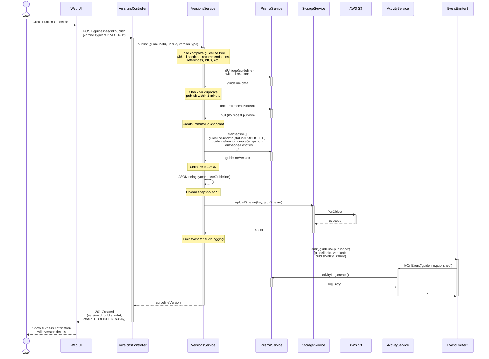

# Publish Workflow

## Overview

This sequence diagram shows the flow when a user publishes a guideline snapshot. Publishing creates an immutable record of the guideline at a point in time and uploads it to S3 for archival.

## Process Steps

1. User initiates publish action from UI
2. VersionsController receives POST request
3. VersionsService creates immutable snapshot
4. Prisma transaction captures all guideline data
5. StorageService uploads snapshot to S3
6. Guideline status transitions to PUBLISHED
7. ActivityService logs the event
8. Response returned to user with version details

## Sequence Diagram



## Key Decisions

### 1. Immutable Snapshots

Once published, a version cannot be modified. This ensures:
- Clear audit trail of what was published when
- Ability to compare versions
- Archival compliance
- Reproducible exports

### 2. Transactional Consistency

All entity data is captured in a single Prisma transaction to ensure:
- Complete snapshot even if guideline is being edited
- No race conditions with concurrent edits
- All-or-nothing semantics

### 3. S3 Upload

The complete snapshot is uploaded to S3 as JSON:
- Durable long-term storage
- Enables historical recovery
- Separate from live editing database
- Compliant with regulations requiring data archival

### 4. Idempotency

If a user publishes twice within 60 seconds with identical options, the system returns the existing version rather than creating a duplicate. This prevents accidental double-publishes.

### 5. Event Emission

Publishing emits an event that triggers audit logging. This:
- Decouples versioning from auditing
- Makes it easy to add new actions on publish (notifications, webhooks, etc.)
- Follows module boundary rules

## Error Handling

### Deleted Guideline

```
If guideline.isDeleted = true:
  → BadRequestException: "Cannot publish a deleted guideline"
```

### Not Found

```
If guideline doesn't exist:
  → NotFoundException: "Guideline {id} not found"
```

### Permission Denied

```
If user is not AUTHOR:
  → ForbiddenException: "User does not have permission to publish"
```

### S3 Upload Failure

```
If S3 upload fails:
  → PdfExportException: "Failed to upload snapshot"
  → Version record is created but marked status=UPLOAD_FAILED
  → User must retry or contact support
```

## Performance Characteristics

- **Load guideline**: ~50-200ms (depends on size)
- **Create snapshot**: ~5-20ms (database operation)
- **Upload to S3**: ~1-5s (network I/O)
- **Total time**: ~2-6s

The S3 upload is the critical path. For large guidelines (> 50MB), consider:
- Streaming upload with progress
- Compression of snapshot JSON
- Splitting into multiple parts

## Related Documentation

- [ADR-005: Async PDF Generation Pipeline](../adr/005-async-pdf-generation.md) - Similar async pattern for PDFs
- [Versions Service](../../api/versions.md) - API reference for publish endpoint
- OpenGRADE Architecture: Section 2.1 (Entity-to-FHIR Mapping)
