# Voting Workflow

## Overview

This sequence diagram shows the flow when panel members vote on recommendations or participate in polls. The system enforces conflict of interest (COI) rules, tracks votes, and tallies results. Users can change their votes at any time before the poll closes.

## Process Steps

1. Poll is created by author (associated with guideline and optional recommendation)
2. Panel members view active polls
3. User clicks to vote
4. System checks for COI conflicts
5. If COI found, user is excluded from voting
6. If no COI, vote is recorded or updated (upsert)
7. Votes are tallied immediately
8. Author can view results in real-time
9. Author closes poll when complete

## Sequence Diagram

```mermaid
sequenceDiagram
    actor Author
    participant PollUI as Poll UI
    participant PollController as PollsController
    participant PollService as PollsService
    participant Prisma as PrismaService
    participant COI as CoiService
    participant EventBus as EventEmitter2
    actor Voter as Panel Member

    Author->>PollUI: Create Poll<br/>{title, options, closeDate}
    activate PollUI
    PollUI->>PollController: POST /polls<br/>{guidelineId, recommendationId, title, options}
    activate PollController

    PollController->>PollService: create(dto, userId)
    activate PollService

    PollService->>Prisma: poll.create({<br/>  guidelineId,<br/>  recommendationId,<br/>  title,<br/>  options,<br/>  isActive: true,<br/>  createdBy: userId<br/>})
    activate Prisma
    Prisma-->>PollService: poll
    deactivate Prisma

    PollService->>EventBus: emit('poll.created')<br/>{pollId, guidelineId}
    activate EventBus
    EventBus-->>PollService: ✓
    deactivate EventBus

    PollService-->>PollController: poll
    deactivate PollService

    PollController-->>PollUI: 201 Created {pollId, status: active}
    deactivate PollController

    PollUI-->>Author: Poll created and active
    deactivate PollUI

    par Panel Members Voting

        loop Panel Member Views Poll
            Voter->>PollUI: View active polls for guideline
            PollUI->>PollController: GET /polls?guidelineId=:id
            activate PollController

            PollController->>PollService: findByGuideline(guidelineId)
            activate PollService

            PollService->>Prisma: poll.findMany({<br/>  guidelineId,<br/>  isActive: true<br/>})
            activate Prisma
            Prisma-->>PollService: polls[]
            deactivate Prisma

            PollService-->>PollController: polls
            deactivate PollService

            PollController-->>PollUI: 200 OK {polls: [...]}
            deactivate PollController

            PollUI-->>Voter: Show "Vote Now" button<br/>with poll options
        end

        Voter->>PollUI: Click option (e.g., "Agree")
        activate PollUI

        PollUI->>PollController: POST /polls/:id/vote<br/>{value: "agree", comment: "..."}
        activate PollController

        Note over PollController: Extract userId and pollId
        PollController->>PollService: castVote(pollId, dto, userId)
        activate PollService

        Note over PollService: Find the poll
        PollService->>Prisma: poll.findUnique({id: pollId})
        activate Prisma
        Prisma-->>PollService: poll
        deactivate Prisma

        alt Poll Not Found
            PollService-->>PollController: NotFoundException
            PollController-->>PollUI: 404 Not Found
        else Poll Closed
            PollService-->>PollController: ForbiddenException<br/>"Poll is closed"
            PollController-->>PollUI: 403 Forbidden
        else Poll Active

            Note over PollService: Check COI exclusion
            PollService->>COI: checkExcludedFromVoting(userId, poll.guidelineId)
            activate COI

            Note over COI: Query: is there a COI record<br/>with excludeFromVoting=true?
            COI->>Prisma: coiInterventionConflict.findFirst({<br/>  where: {<br/>    excludeFromVoting: true,<br/>    coiRecord: { guidelineId, userId }<br/>  }<br/>})
            activate Prisma
            Prisma-->>COI: conflict or null
            deactivate Prisma

            alt COI Found
                COI-->>PollService: {conflicted: true}
                PollService-->>PollController: ForbiddenException<br/>"Excluded due to COI"
                PollController-->>PollUI: 403 Forbidden
                PollUI-->>Voter: "You cannot vote due<br/>to conflict of interest"
            else No COI
                COI-->>PollService: {conflicted: false}

                Note over PollService: Record or update vote
                PollService->>Prisma: pollVote.upsert({<br/>  where: { pollId_userId },<br/>  create: {<br/>    pollId,<br/>    userId,<br/>    value: dto.value,<br/>    comment: dto.comment<br/>  },<br/>  update: {<br/>    value: dto.value,<br/>    comment: dto.comment<br/>  }<br/>})
                activate Prisma
                Prisma-->>PollService: vote
                deactivate Prisma

                Note over PollService: Emit event for real-time updates
                PollService->>EventBus: emit('poll.voted')<br/>{pollId, userId, value,<br/>totalVotes: count}
                activate EventBus
                EventBus-->>PollService: ✓
                deactivate EventBus

                PollService-->>PollController: vote
                deactivate PollService

                PollController-->>PollUI: 200 OK {vote: {...}}
                deactivate PollController

                PollUI-->>Voter: "Vote recorded"<br/>Show live tally
            end
        end

        deactivate PollUI
    and Author Views Results
        loop Author Polls Results
            Author->>PollUI: Refresh poll results
            PollUI->>PollController: GET /polls/:id
            activate PollController

            PollController->>PollService: findOne(pollId)
            activate PollService

            PollService->>Prisma: poll.findUnique({<br/>  id: pollId,<br/>  include: {<br/>    votes: { select: { value, comment } },<br/>    _count: { select: { votes: true } }<br/>  }<br/>})
            activate Prisma
            Prisma-->>PollService: poll with votes
            deactivate Prisma

            Note over PollService: Tally votes by value
            PollService->>PollService: tallyVotes(votes)<br/>returns { agree: 5, disagree: 2, abstain: 1 }

            PollService-->>PollController: poll with tally
            deactivate PollService

            PollController-->>PollUI: 200 OK<br/>{pollId, title,<br/>tally: {agree: 5, disagree: 2, abstain: 1},<br/>totalVotes: 8,<br/>participationRate: "73%"}
            deactivate PollController

            PollUI-->>Author: Show live tally<br/>Bar charts and percentages
        end
    and
        Author->>PollUI: Click "Close Poll"
        PollUI->>PollController: PATCH /polls/:id<br/>{isActive: false}
        activate PollController

        PollController->>PollService: close(pollId)
        activate PollService

        PollService->>Prisma: poll.update({<br/>  where: { id: pollId },<br/>  data: { isActive: false }<br/>})
        activate Prisma
        Prisma-->>PollService: poll
        deactivate Prisma

        PollService->>EventBus: emit('poll.closed')<br/>{pollId, finalTally}
        activate EventBus
        EventBus-->>PollService: ✓
        deactivate EventBus

        PollService-->>PollController: poll
        deactivate PollService

        PollController-->>PollUI: 200 OK {status: closed}
        deactivate PollController

        PollUI-->>Author: "Poll closed"<br/>Show final results
    end
```



## Key Decisions

### 1. Upsert Pattern

Votes use upsert semantics so users can:
- Change their vote at any time
- No duplicate vote records
- Clear override semantics (new value replaces old)

### 2. COI Enforcement

Before recording a vote, the system checks if the user has an intervention conflict marked with `excludeFromVoting=true`:
- Prevents conflicts of interest from influencing decisions
- Transparent to user (they see why they can't vote)
- Auditable (COI record explains the exclusion)
- Can be appealed by organization admin

### 3. Real-Time Updates

When a vote is cast, an event is emitted so:
- UI can show live tally updates
- WebSocket subscribers see new votes immediately
- No need to refresh to see results
- Better user experience

### 4. Vote Comments

Each vote can include an optional comment so:
- Panel members can explain their reasoning
- Authors can understand dissenting views
- Comments are visible in detailed results (not just to author)

### 5. Poll Closure

Polls can be closed by author to:
- Prevent late votes
- Finalize results
- Lock-in consensus
- Allow moving to next phase

## Error Handling

### Poll Not Found

```
GET /polls/invalid-id
  → 404 Not Found
  → "Poll not found"
```

### Poll Already Closed

```
POST /polls/closed-id/vote
  → 403 Forbidden
  → "This poll is closed"
```

### User Excluded Due to COI

```
POST /polls/id/vote
  → 403 Forbidden
  → "You are excluded from voting due to a conflict of interest"
  → Include COI intervention details in response body
```

### Invalid Vote Value

```
POST /polls/id/vote {value: "invalid"}
  → 400 Bad Request
  → "Vote value must be one of: agree, disagree, abstain"
```

### Unauthorized

```
POST /polls/id/vote without authentication
  → 401 Unauthorized
```

## Performance Characteristics

- **Create poll**: ~5ms
- **Cast vote**: ~50-100ms (includes COI check)
- **Fetch poll results**: ~10-20ms
- **Tally votes**: ~O(n) where n = number of votes

For high-volume polls (>1000 votes), consider:
- Caching tally results
- Using database aggregation instead of application code
- Real-time tally updates via WebSocket

## Poll Statistics

Useful metrics to track:

```typescript
interface PollStats {
  totalVotes: number;
  participationRate: number;  // voted / invitedCount
  agreementRate: number;  // agree / totalVotes
  consensusReached: boolean;  // >80% agree/disagree
  outliers: number;  // abstain votes
}
```

## Related Documentation

- [ADR-004: RBAC Authorization Model](../adr/004-rbac-authorization.md) - Permission checks before voting
- [ADR-002: NestJS Module Boundaries](../adr/002-nestjs-module-boundaries.md) - PollsModule design
- [Polls Service API](../../api/polls.md) - Complete endpoint reference
- [COI Module Documentation](../../api/coi.md) - Conflict of Interest system
